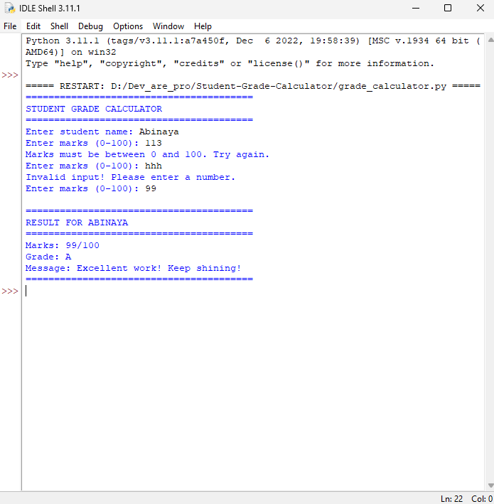

# Student Grade Calculator 🎓

## 📌 Project Overview
This project is a Python-based Student Grade Calculator that takes student marks as input and assigns grades based on predefined criteria. It also provides encouraging messages.

## 🎯 Objectives
- Use conditional statements (if-elif-else)
- Implement input validation
- Use functions
- Handle invalid inputs using loops

## ⚙️ Setup Instructions (IDLE)
1. Open IDLE (Python)
2. Open grade_calculator.py
3. Press F5 to run

## 🏗️ Code Structure
- get_grade(): returns grade and message
- get_valid_marks(): validates input using loop
- Main section: handles user interaction

## ⚙️ Grading Logic
A: 90-100  
B: 80-89  
C: 70-79  
D: 60-69  
F: 0-59  

## 🧠 Technical Details
This program uses:
- Functions for modular design
- While loop for validation
- Try-except for error handling

Architecture:
Input → Validation → Processing → Output

## 📷 Screenshots

### ✅ Valid Input

### ❌ Invalid Input

## 🧪 Testing Evidence
See test_cases.txt

## 📚 What I Learned
- Writing functions in Python
- Handling invalid inputs
- Using loops and conditions together
- Improving program structure and presentation
